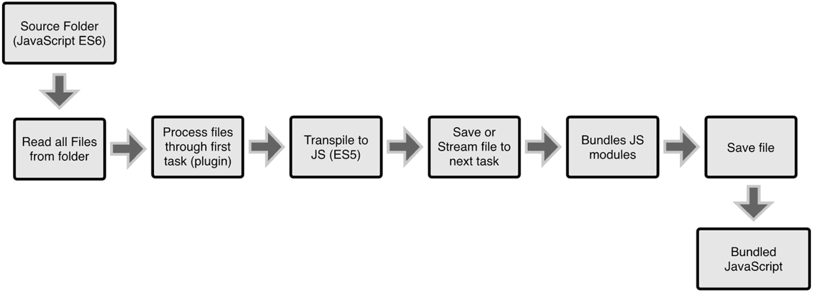

## 构建工具（webpack、gulp、grunt）

- [什么是webpack，与grunt和gulp有什么不同](#什么是webpack，与grunt和gulp有什么不同)
- [webpack-dev-server和http服务器如nginx有什么区别](#webpack-dev-server和http服务器如nginx有什么区别)

### 什么是webpack，与grunt和gulp有什么不同
Webpack是一个模块打包器，他可以递归的打包项目中的所有模块，最终生成几个打包后的文件。

Gulp/Grunt是一种能够优化前端的开发流程的工具，而WebPack是一种模块化的解决方案。

他们的工作方式有较大区别：

　　Grunt和Gulp的工作方式是：在一个配置文件中，指明对某些文件进行类似编译，组合，压缩等任务的具体步骤，工具之后可以自动替你完成这些任务。
    
　　Webpack的工作方式是：把你的项目当做一个整体，通过一个给定的主文件（如：index.js），Webpack将从这个文件开始找到你的项目的所有依赖文件，使用loaders处理它们，最后打包为一个（或多个）浏览器可识别的JavaScript文件。
    
简单来说，webpack和其他的工具最大的不同在于他支持code-splitting、模块化(AMD，ESM，CommonJs)、全局分析。

### webpack-dev-server和http服务器如nginx有什么区别
webpack-dev-server 使用内存来存储webpack开发环境下的打包文件，并且可以使用模块热更新，他比传统的http服务对开发更加简单高效；

    webpack-dev-server 的原理：正向代理隐藏了真实的客户端，而反向代理隐藏了真实的服务器，webpack-dev-server 扮演了一个代理服务器的角色，由于服务器之间通信不会存在前端常见的同源策略，这样当请求 webpack-dev-server时，它会从真实的服务器中请求数据，然后将数据发送给浏览器；
    webpack-dev-server 主要是启动了一个使用express的Http服务器，启动webpack-dev-server后，你在目标文件夹中是看不到编译后的文件的,实时编译后的文件都保存到了内存当中，因此使用webpack-dev-server进行开发的时候看不到编译后的文件；

